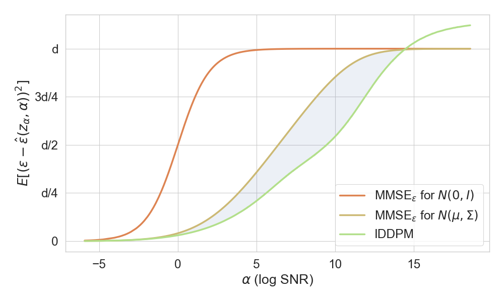

# Information-Theoretic Diffusion (ITD)

- Code for the paper [Information-Theoretic Diffusion](https://arxiv.org/abs/2302.03792), published at ICLR 2023. 
- A [**simplified demonstration**](https://github.com/gregversteeg/InfoDiffusionSimple) is also provided with vivid visualization and examples.


## Main Contribution
We introduce a new mathematical foundation for diffusion models inspired by classic results in information theory, which yields an **_exact_** unified objective for modeling either **continuous** or **discrete** data and provides justification for ensembling of diffusion models.

$$ \log p(x) = - \frac{1}{2} \int_{0}^{\infty} \text{mmse}(x, \gamma) d\gamma + \text{const} \qquad \text{where} \quad \text{mmse} = \min_{\hat{x}} E_{p(z_{\gamma}|x)}\big[ \| x - \hat{x}(z_{\gamma}, \gamma) \|^2 \big] $$

<p align="center", width="100%">
    
    
</p>

# Usage
## Installation
Clone this repository and navigate to './ITdiffusion' as working directory in the Linux terminal or Anaconda Powershell Prompt, then run the command:

```
pip install -e .
```

This would install the 'itdiffusion' python package that scripts depend on.

(<span style="color:red">**Note**</span>: If you meet troubles when installing the 'mpi4py' library, please refer [here](https://pypi.org/project/mpi4py/). Run the above command **again** after fixing the problem.)


## Utilities
Folder 'utilsitd' includes the utilities for our diffusion model, and especially, the ITD model is wrapped in [diffusionmodel.py](https://github.com/kxh001/ITdiffusion/blob/main/utilsitd/diffusionmodel.py). 

## Preparing Data
We use CIFAR-10 dataset in our paper. The dataset preprocessing code is provided by [dataset generation](https://github.com/openai/improved-diffusion/tree/main/datasets).
For convenience, we include it in [cifar10.py](https://github.com/kxh001/ITdiffusion/blob/main/datasets/cifar10.py). You could run it directly to get processed dataset.

## Fine-tuning
#### The following commands are used to run 'fine_tune.py':
1. IDDPM + CIFAR10 + vlb:
```
python ./scripts/fine_tune.py 
--data_train_dir XXX/cifar_train 
--model_path XXX/iddpm/cifar10_uncond_vlb_50M_500K.pt 
--image_size 32 --num_channels 128 --num_res_blocks 3 --learn_sigma True --dropout 0.3 
--iddpm True --train_batch_size 32 --lr 2.5e-5 --epoch 10
```
2. DDPM + CIFAR10:
```
python ./scripts/fine_tune.py 
--data_train_dir XXX/cifar_train
--image_size 32
--iddpm False --train_batch_size 64 --lr 1e-4 --epoch 10
```

#### For evaluation, run 'test.py' directly:
1. IDDPM + CIFAR10 + vlb:
```
python ./scripts/test.py 
--data_train_dir XXX/cifar_train --data_test_dir XXX/cifar_test
--model_path ../checkpoints/iddpm/model_epoch10.pt 
--image_size 32 --num_channels 128 --num_res_blocks 3 --learn_sigma True --dropout 0.3 
--iddpm True --test_batch_size 256 --npoints 1000 --soft True
```
2. DDPM + CIFAR10:
```
python ./scripts/test.py 
--data_train_dir XXX/cifar_train --data_test_dir XXX/cifar_test
--image_size 32
--iddpm False --test_batch_size 256 --npoints 1000 --soft True
```

## Models
- The pre-trained IDDPM model could be downloaded [here](https://openaipublic.blob.core.windows.net/diffusion/march-2021/cifar10_uncond_vlb_50M_500K.pt).

- We use pre-trained DDPM model from Huggingface via [diffusers](https://github.com/huggingface/diffusers) library.

- Fined-tuned models could be found [here](https://github.com/kxh001/ITdiffusion/tree/main/checkpoints).


## Results
- Run ```python ./script/plot_results.py``` to get figures and tables in the paper.
- We show a subset results below, and please refer to paper for more detailed results.


<style type="text/css">
.tg  {border-collapse:collapse;border-color:#93a1a1;border-spacing:0;}
.tg td{background-color:#fdf6e3;border-color:#93a1a1;border-style:solid;border-width:0px;color:#002b36;
  font-family:Arial, sans-serif;font-size:14px;overflow:hidden;padding:4px 8px;word-break:normal;}
.tg th{background-color:#657b83;border-color:#93a1a1;border-style:solid;border-width:0px;color:#fdf6e3;
  font-family:Arial, sans-serif;font-size:14px;font-weight:normal;overflow:hidden;padding:4px 8px;word-break:normal;}
.tg .tg-x6g0{background-color:#eee8d5;border-color:#000000;text-align:left;vertical-align:middle}
.tg .tg-18eh{border-color:#000000;font-weight:bold;text-align:center;vertical-align:middle}
.tg .tg-wybg{background-color:#eee8d5;border-color:#000000;color:#000000;text-align:left;vertical-align:middle}
.tg .tg-7ca6{background-color:#eee8d5;border-color:#000000;text-align:center;vertical-align:middle}
.tg .tg-xwyw{border-color:#000000;text-align:center;vertical-align:middle}
.tg .tg-w24n{background-color:#eee8d5;border-color:#000000;font-weight:bold;text-align:center;text-decoration:underline;
  vertical-align:middle}
</style>
<table class="tg">
    <thead>
      <tr>
        <th class="tg-xwyw" rowspan="2">Model</th>
        <th class="tg-xwyw" rowspan="2">Training Objective</th>
        <th class="tg-xwyw" colspan="2">Test-time estimate</th>
      </tr>
      <tr>
        <th class="tg-wybg">Variational Bound</th>
        <th class="tg-wybg">IT Bound (ours)</th>
      </tr>
    </thead>
    <tbody>
      <tr>
        <td class="tg-xwyw">IDDPM</td>
        <td class="tg-xwyw">Variational</td>
        <td class="tg-xwyw">-4.05</td>
        <td class="tg-18eh">-4.09</td>
      </tr>
      <tr>
        <td class="tg-x6g0">IDDPM (tune)</td>
        <td class="tg-7ca6">Info-Theoretic</td>
        <td class="tg-7ca6">-3.85</td>
        <td class="tg-w24n">-4.28</td>
      </tr>
    </tbody>
</table>


<p  width="100%">
    
    
</p>


(<span style="color:red">**Note**</span>: For benchmark results with variational bounds, please read the [README.md](https://github.com/kxh001/ITdiffusion/blob/main/benchmark/improved-diffusion). )


## BibTeX
```
@inproceedings{
kong2023informationtheoretic,
title={Information-Theoretic Diffusion},
author={Xianghao Kong and Rob Brekelmans and Greg {Ver Steeg}},
booktitle={International Conference on Learning Representations},
year={2023},
url={https://arxiv.org/abs/2302.03792} }
```

## References
- Alex Nichol's [implement of IDDPM](https://github.com/openai/improved-diffusion).
- HuggingFace's [diffusers](https://github.com/huggingface/diffusers) library.
- See our [simplified demonstration](https://github.com/gregversteeg/InfoDiffusionSimple) for better understanding.

