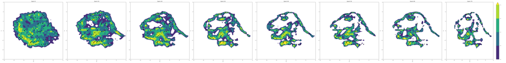
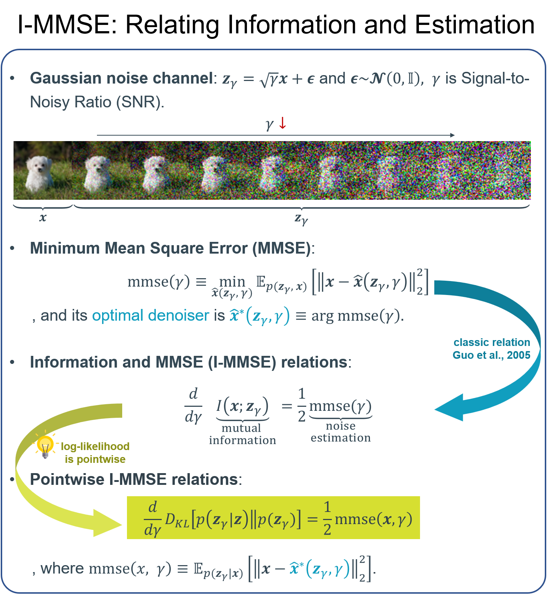
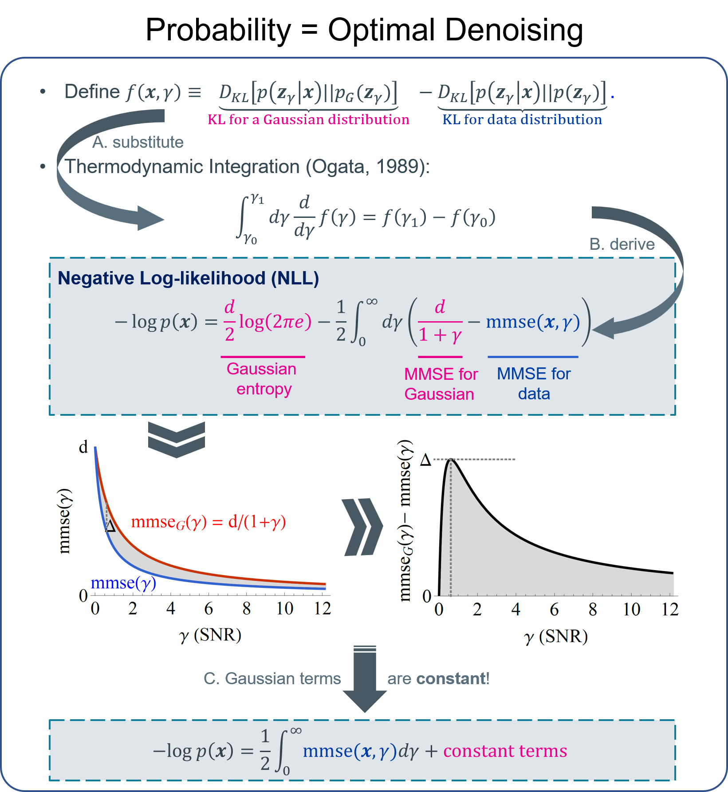
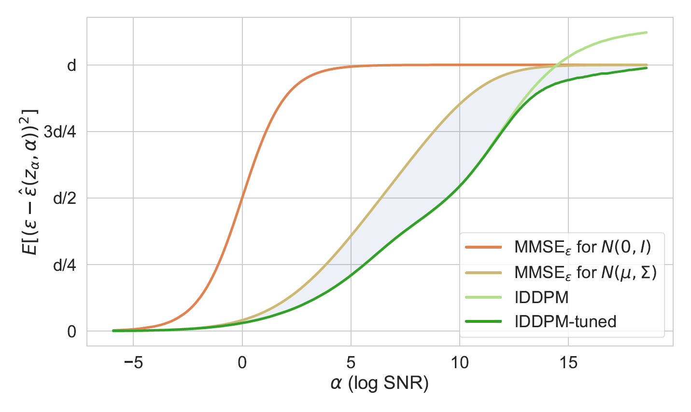

# Information-Theoretic Diffusion (ITD)

- Code for the paper [Information-Theoretic Diffusion](https://arxiv.org/abs/2302.03792), published at ICLR 2023. 
- A [**simplified demonstration**](https://github.com/gregversteeg/InfoDiffusionSimple) is also provided with vivid visualization and examples.



## Main Contribution
We introduce a new mathematical foundation for diffusion models inspired by classic results in information theory, which yields an **_exact_** unified objective for modeling either **continuous** or **discrete** data and provides justification for ensembling of diffusion models.

$$ \log p(x) = - \frac{1}{2} \int_{0}^{\infty} \text{mmse}(x, \gamma) d\gamma + \text{const} \qquad \text{where} \quad \text{mmse} = \min_{\hat{x}} E_{p(z_{\gamma}|x)}\big[ \| x - \hat{x}(z_{\gamma}, \gamma) \|^2 \big] $$

<p align="center", width="100%">
    
    
</p>

## Diffusion Math Comparison
<center>

|          | Variational Bound  <br/> $-\log p(x) \quad {\leq} \underbrace{L_0}_{\substack{\text{discrete}\\ \text{reconstruction}}} + \underbrace{L_{1:T-1}}_{\text{MSE terms}} + \underbrace{L_T}_{\text{prior}}$ | Information-Theoretic Bound (ours) <br/> -\log p(x) = constant + \frac{1}{2} \int_0^\infty \mmse(x, \gamma) d\gamma |
|:--------:|:------------------------------------------------------------------------------------------------------------------------------------------------------------------------------------------------------:|:-------------------------------------------------------------------------------------------------------------------:|
|  Exact?  |                                                                                       No, it's an approximation                                                                                        |                                         **YES**, it's an analytic solution                                          |
| Simple？ |                                                                                        No, it has non-MSE terms                                                                                        |                                          **YES**, it has only one integral                                          |

</center>

# Usage
## Installation
Clone this repository and navigate to './ITdiffusion' as working directory in the Linux terminal or Anaconda Powershell Prompt, then run the command:

```
pip install -e .
```

This would install the 'itdiffusion' python package that scripts depend on.

(<span style="color:red">**Note**</span>: If you meet troubles when installing the 'mpi4py' library, please refer [here](https://pypi.org/project/mpi4py/). Run the above command **again** after fixing the problem.)


## Utilities
Folder 'utilsitd' includes the utilities for our diffusion model, and especially, the ITD model is wrapped in [diffusionmodel.py](https://github.com/kxh001/ITdiffusion/blob/main/utilsitd/diffusionmodel.py). 

## Preparing Data
We use CIFAR-10 dataset in our paper. The dataset preprocessing code is provided by [dataset generation](https://github.com/openai/improved-diffusion/tree/main/datasets).
For convenience, we include it in [cifar10.py](https://github.com/kxh001/ITdiffusion/blob/main/datasets/cifar10.py). You could run it directly to get processed dataset.

## Fine-tuning
#### The following commands are used to run 'fine_tune.py':
1. IDDPM + CIFAR10 + vlb:
```
python ./scripts/fine_tune.py 
--data_train_dir XXX/cifar_train 
--model_path XXX/iddpm/cifar10_uncond_vlb_50M_500K.pt 
--image_size 32 --num_channels 128 --num_res_blocks 3 --learn_sigma True --dropout 0.3 
--iddpm True --train_batch_size 32 --lr 2.5e-5 --epoch 10
```
2. DDPM + CIFAR10:
```
python ./scripts/fine_tune.py 
--data_train_dir XXX/cifar_train
--image_size 32
--iddpm False --train_batch_size 64 --lr 1e-4 --epoch 10
```

#### For evaluation, run 'test.py' directly:
1. IDDPM + CIFAR10 + vlb:
```
python ./scripts/test.py 
--data_train_dir XXX/cifar_train --data_test_dir XXX/cifar_test
--model_path ../checkpoints/iddpm/model_epoch10.pt 
--image_size 32 --num_channels 128 --num_res_blocks 3 --learn_sigma True --dropout 0.3 
--iddpm True --test_batch_size 256 --npoints 1000 --soft True
```
2. DDPM + CIFAR10:
```
python ./scripts/test.py 
--data_train_dir XXX/cifar_train --data_test_dir XXX/cifar_test
--image_size 32
--iddpm False --test_batch_size 256 --npoints 1000 --soft True
```

## Models
- The pre-trained IDDPM model could be downloaded [here](https://openaipublic.blob.core.windows.net/diffusion/march-2021/cifar10_uncond_vlb_50M_500K.pt).

- We use pre-trained DDPM model from Huggingface via [diffusers](https://github.com/huggingface/diffusers) library.

- Fined-tuned models could be found [here](https://github.com/kxh001/ITdiffusion/tree/main/checkpoints).


## Results
- Run ```python ./script/plot_results.py``` to get figures and tables in the paper.
- We show a result subset below, and please refer to the [paper](https://arxiv.org/abs/2302.03792) for more detailed results. (<span style="color:red">**Note**</span>: For benchmark results with variational bounds, please read the [README.md](https://github.com/kxh001/ITdiffusion/blob/main/benchmark/improved-diffusion). )


<div align="center">

|     Model    | Training Objective | Variational Bound  |    IT Bound (ours)    |
|:------------:|:------------------:|:------------------:|:---------------------:|
|     IDDPM    |     Variational    |        -4.05       |       **-4.09**       |
| IDDPM (tune) |   Info-Theoretic   |        -3.85       |       **-4.28**       |

</div>


<p  align="center", width="100%">
    
</p>

## BibTeX
```
@inproceedings{
kong2023informationtheoretic,
title={Information-Theoretic Diffusion},
author={Xianghao Kong and Rob Brekelmans and Greg {Ver Steeg}},
booktitle={International Conference on Learning Representations},
year={2023},
url={https://arxiv.org/abs/2302.03792} }
```

## References
- Alex Nichol's [implement of IDDPM](https://github.com/openai/improved-diffusion).
- HuggingFace's [diffusers](https://github.com/huggingface/diffusers) library.
- See our [simplified demonstration](https://github.com/gregversteeg/InfoDiffusionSimple) for better understanding.

